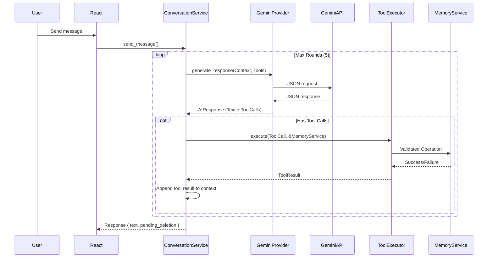

# NOVA Tools Architecture

## Overview
NOVA uses a structured, multi-turn tool execution layer to allow the Gemini Provider to safely interact with the local desktop environment (specifically, the SQLite memory database).

## Architecture Flow

## Security & Validation
- **Allowlisting**: Tools are hardcoded in `src-tauri/src/ai/executor.rs`. If the LLM generates an unknown tool, it is immediately rejected with `UNKNOWN_TOOL`.
- **Validation Boundary**: The `ToolExecutor` passes arguments to the `MemoryService`, which strictly enforces database constraints (e.g., maximum string lengths, UUID valid formats, Category enum validation).
- **Assessment Mode**: If `NovaState` detects Assessment Mode is active, `send_message` returns an error immediately, blocking all AI API calls and local memory executions.

## Implemented Tools
1. `create_memory(content, category)`
2. `search_memory(query)` 
3. `get_memory(id)`
4. `update_memory(id, content, category)`
5. `delete_memory(id)`

## The Deletion Mechanism
NOVA deliberately rejects arbitrary AI deletions.
1. When Gemini calls `delete_memory(id)`, `ToolExecutor` does **not** delete the record.
2. It returns a JSON object indicating `pending_confirmation`.
3. The React UI extracts this pending status and renders an interactive prompt (`Cancel` or `Delete`).
4. If the user confirms, the UI manually executes the raw `delete_memory` command and appends a "I confirmed the deletion" message to the context loop.
